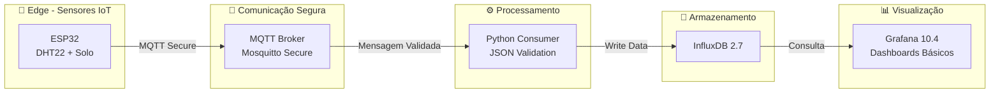
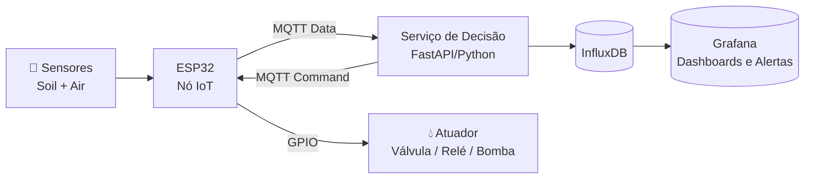

<p align="center"> 
  </p>

# 🚜 Smart Farm IoT System
### *Arquitetura IoT Segura para Monitoramento Ambiental em Agricultura de Precisão*


  

  <a href="https://github.com/GustavoFelipe85/smart-farm-iot-system/actions/workflows/ci.yml">


<div align="center">


<a href="https://github.com/GustavoFelipe85/smart-farm-iot-system/actions/workflows/ci.yml">
  
</a>

---

# 📘 Resumo Executivo

O Smart Farm IoT System é uma plataforma modular de monitoramento ambiental agrícola, baseada em uma arquitetura IoT segura e containerizada.

O sistema implementa:

- Captura via ESP32 + sensores  
- Comunicação MQTT autenticada (Mosquitto)  
- Ingestão e validação em Python  
- Armazenamento time-series em InfluxDB  
- Dashboards analíticos no Grafana  

Funcionalidades como API, automação, ML e atuadores serão implementadas nas Fases 3 e 4.

---

> 📝 **Projeto integrante do processo seletivo do Programa de Pós-Graduação em Ciência da Computação (PPGComp) – UNIOESTE.**  
> Desenvolvimento conduzido com rigor metodológico e reprodutibilidade, alinhado à linha *Sistemas de Computação*, conforme Edital 11/2025.

Este repositório documenta integralmente a **Fase 2**, incluindo:

- arquitetura distribuída  
- pipeline IoT completo  
- validação de dados  
- persistência estruturada  
- dashboards analíticos  
- documentação técnica formal  

As **Fases 3 e 4** (sensores reais, laboratório, campo, automação e ML) serão executadas durante o Mestrado.

---

## 🧪 Status do Pipeline de CI

⚠️ O pipeline de CI está ativo e validando continuamente o repositório.

Falhas atuais refletem testes e integrações de hardware ainda em desenvolvimento,
característicos da **Fase 3 (Hardware Real / CELUS)**.

O pipeline já está preparado para estabilização completa nas Fases 4 e seguintes.

---

# 🎯 Objetivos do Projeto

- Criar uma arquitetura IoT segura, replicável e modular  
- Monitorar temperatura, umidade do ar e umidade do solo  
- Registrar medições em banco time-series  
- Disponibilizar dashboards analíticos  
- Construir base técnica para automação, controle e ML  

---

# 📚 Documentação Oficial

Toda a documentação técnica, acadêmica e de planejamento está disponível em:

➡️ [`/docs`](./docs)

---

# 🧩 Fases do Projeto

| Fase                                                 | Descrição                                              | Status             | Entregas                             |
| ---------------------------------------------------- | ------------------------------------------------------ | ------------------ | ------------------------------------ |
| 🟦 Fase 1 — Infraestrutura IoT                       | Sensores, firmware e MQTT Broker                       | ✅ Concluída        | ESP32 + MQTT Secure                  |
| 🟦 Fase 2 — Processamento e Visualização             | Ingestão, persistência e dashboards                    | ✅ Concluída        | Python Consumer + InfluxDB + Grafana |
| 🟦 **Fase 3 — Expansão Inteligente & Hardware Real** | API, automação, ML e **prototipagem física com CELUS** | 🟨 **Em execução** | Hardware v1 + FastAPI + ML           |

> 💡 **Status Atual:** Fase 3 em andamento (Hardware Assistido por IA – CELUS)

---

## 🔧 Integração com CELUS (Fase 3 — Hardware Assistido por IA)

Na Fase 3 o projeto passa da simulação para o hardware real.  
O design eletrônico é desenvolvido dentro do **CELUS Design Studio**, permitindo:

- geração automatizada de esquemas eletrônicos (ESP32 + sensores)
- criação assistida de PCB
- documentação eletrônica padronizada
- lista de materiais (BOM)
- pinout detalhado por cubo (MCU + sensores)
- infraestrutura reprodutível para laboratório e testes

📎 **Arquivos exportados da Fase 3 (Hardware v1) estão em:**  
`/hardware/celus-v1/`

🔗 **Link do projeto no CELUS:**  
https://app.celus.io/design-studio/692de65654a678ec656686fe/design-canvas

---

# 🏗️ Arquitetura Implementada


# 🔧 **Componentes Implementados (Fase 2 – Concluída)**

| Camada       | Tecnologia       | Status | Função               |
| ------------ | ---------------- | ------ | -------------------- |
| IoT Device   | ESP32 + Sensores | ✅      | Captura ambiental    |
| Broker       | Mosquitto + Auth | ✅      | Comunicação segura   |
| Consumer     | Python 3.11      | ✅      | Validação + ingestão |
| Banco        | InfluxDB 2.7     | ✅      | Time-series          |
| Visualização | Grafana 10.4     | ✅      | Dashboards           |
| Infra        | Docker Compose   | ✅      | Orquestração         |

---

# ❌ **O que NÃO existe (rigor acadêmico)**

| Funcionalidade        | Status            |
| --------------------- | ----------------- |
| API FastAPI           | ❌                 |
| Automação (atuadores) | ❌                 |
| Machine Learning      | ❌                 |
| Dashboards avançados  | ⚠️ Apenas básicos |
| Alertas/Notificações  | ❌                 |
| Controle de irrigação | ❌                 |

---

# ⚙️ **Fluxo Operacional**

### 1️⃣ Captura — ESP32

```json
                               {
                              "device": "esp32-node-01",
                           "timestamp": "2025-11-11T14:57:00Z",
                                     "metrics": {
                                  "temperature": 25.7,
                                   "humidity": 63.1,
                                 "soil_moisture": 41.2
                                               }
                                            }
```

### 2️⃣ Transporte — MQTT Seguro (Auth)

### 3️⃣ Ingestão — Python Consumer

* valida JSON
* trata erros
* rejeita payload inválido
* grava no InfluxDB

### 4️⃣ Armazenamento — InfluxDB 2.7

### 5️⃣ Visualização — Grafana

---

# 🧪 **Metodologia Operacional**

* Frequência de amostragem: **30s**
* MQTT QoS: **1**
* Sanitização completa do payload
* Persistência com política de retenção
* Dashboards exploratórios

---

# 📈 **Resultados Obtidos (Fase 2)**

| Indicador                | Valor              |
| ------------------------ | ------------------ |
| Latência MQTT → Consumer | **< 120 ms**       |
| Taxa de ingestão         | **10.000+ msgs/h** |
| Uptime (Docker)          | **99.9%**          |
| Retenção                 | configurável       |

---

# 🔐 **Segurança Implementada**

* MQTT com `allow_anonymous false`
* Autenticação por arquivo `passwords`
* Variáveis sensíveis no `.env`
* `.env.example` fornecido
* Rede Docker isolada
* Senha do Grafana via env

---

# 📘 **.env.example (versão final)**

---

```bash
                   # MQTT
                   MQTT_BROKER=mosquitto
                   MQTT_PORT=1883
                   MQTT_USERNAME=iot_user
                   MQTT_PASSWORD=SUA_SENHA_AQUI

                   # INFLUXDB
                   INFLUX_URL=http://influxdb:8086
                   INFLUX_ORG=smartfarm
                   INFLUX_BUCKET=sensors
                   INFLUX_TOKEN=SUA_CHAVE_INFLUX

                   # GRAFANA
                   GRAFANA_PASSWORD=SUA_SENHA_GRAFANA

```
---

# 🚀 **Quick Start (5 minutos)**

```bash
                   git clone https://github.com/GustavoFelipe85/smart-farm-iot-system
                   cd smart-farm-iot-system

                   copy .env.example .env  # Windows
                   cp .env.example .env    # Linux / macOS

                   cd docker
                   docker-compose up -d
```

Acessos:

* 📊 Grafana → [http://localhost:3000](http://localhost:3000)
* 💾 InfluxDB → [http://localhost:8086](http://localhost:8086)
* 📡 MQTT Broker → mqtt://localhost:1883

---

# 🎓 **Contribuições Acadêmicas**

* Arquitetura IoT modular e segura
* Pipeline completo de ingestão
* Documentação científica reprodutível
* Validação robusta de dados
* Base para ML e automação

---

# 📚 **Referências**

* Wolfert, S. et al. *Big Data in Smart Farming.* Agricultural Systems, 2017.
* Zhang, Y. *IoT Applications in Smart Agriculture.* JAI, 2022.
* ConectarAGRO. *Agricultura 4.0.*
* Este trabalho evolui do TCC: 
[📘 TCC – “Fatores e Aplicações Limitantes da IoT na Agricultura” (UNISA)](https://dspace.unisa.br/items/ab0577db-a4a9-4fc7-af72-d1b23e7345ed)

---

# 👨‍💻 **Autor**

**Gustavo Felipe Paluch Figueiredo**

Bacharelado em Engenharia da Computação 🎓

Universidade Santo Amaro (Unisa)

🔗 LinkedIn: https://www.linkedin.com/in/gustavofpaluch
 
📧 Email: gustavo.f.p.f@outlook.com.br

---

<div align="center">

### ✨ “Tecnologia e ciência transformando a agricultura brasileira.”

📌 Documento técnico elaborado para o processo seletivo do **PPGComp – UNIOESTE (Edital 11/2025)**

Este repositório documenta integralmente a **Fase 2**, concluída com foco em rigor metodológico, reprodutibilidade e aderência às diretrizes de pesquisa em Sistemas de Computação.

---

# 📚 Documentação Oficial (Fase 2)

Este repositório inclui toda a documentação técnica referente à Fase 2 do projeto, contendo requisitos, arquitetura, diagramas e histórico de versões.

- [Requisitos do Sistema (Fase 2)](docs/requisitos.md)
- [Especificação Técnica da Arquitetura](docs/especificacao_arquitetura.md)
- [Diagrama da Arquitetura (Mermaid)](docs/architecture.md)
- [Histórico de Versões e Roadmap](docs/versoes.md)

---

# 🧩 Hardware (Fase 3)

O hardware do projeto Smart Farm IoT System — incluindo o protótipo baseado em ESP32-S3, sensores ambientais e sensor capacitivo de solo — está documentado na pasta:

➡️ **[/hardware](hardware/)**

Lá você encontra:

- Estrutura completa do hardware
- Versão celus-v1 do design (prototipagem assistida por IA)
- Esquemáticos, BOM e canvas (ao serem exportados)
- Datasheets oficiais
- Planejamento para a PCB v2 (laboratório / mestrado)


---

# 🌧️ Fase 4 — Automação da Irrigação (Visão Futura)

A Fase 4 representa a evolução natural do Smart Farm IoT System, estendendo o monitoramento para **controle automatizado de irrigação**.
Esta fase **não precisa ser implementada agora**, mas define o escopo que será desenvolvido durante o Mestrado, conforme disponibilidade de laboratório, equipamentos e campo experimental.

### 🎯 Objetivos da Fase 4

* Integrar **atuadores reais** (relé/mosfet/válvula solenóide) ao nó ESP32
* Implementar lógica de controle baseada em:

  * regras agronômicas (limiares)
  * modelos simples de previsão de umidade do solo
  * possibilidade futura de ML supervisionado
* Criar um **loop fechado de decisão**:

  ```
                             Sensor → MQTT → Análise → Decisão → Comando → Atuador 
  ```
* Avaliar impacto da automação na:

  * economia hídrica
  * estabilidade do solo
  * eficiência da irrigação
  * latência e confiabilidade do sistema

---

### 🔧 Arquitetura prevista



---

### 🧠 Estratégias de Controle Investigadas

* Controle baseado em **limiar de umidade do solo**
* Controle baseado em **janela temporal** (irrigação em horários específicos)
* Controle baseado em **histerese** (evita liga/desliga contínuo)
* Previsão de umidade (baseline ML):

  * regressão linear
  * regressão por árvore
  * modelos simples baseados em evapotranspiração

---

### 🧪 Metodologia Experimental Prevista

* Testes em bancada com simulador de solo
* Testes com diferentes tipos de solo (arenoso/argiloso)
* Variação de fluxo de água e tempo de acionamento
* Monitoramento contínuo via InfluxDB
* Geração de dashboards avançados no Grafana
* Avaliação de:

  * consumo hídrico
  * tempo de resposta
  * confiabilidade do laço de controle

---

### 📦 Entregas Principais da Fase 4

* Firmware atualizado do ESP32 com suporte a atuadores
* Microserviço de decisão (FastAPI ou Python Worker)
* Esquema de tópicos MQTT para automação
* Logging completo (comandos, falhas, restituição manual)
* Dashboards operacionais de irrigação
* Relatório técnico dos resultados

---

### 🔭 Impacto no Mestrado

A Fase 4 abre espaço para:

* experimentos aplicados
* artigos científicos envolvendo IoT + agricultura
* avaliação quantitativa de automação de irrigação
* modelos de previsão e controle
* continuidade para dissertação

---

### 📝 Observação

Esta fase **não faz parte da entrega atual**, mas demonstra planejamento, escalabilidade e maturidade do projeto — algo que pesa muito positivamente em processos seletivos como o PPGComp.

---


