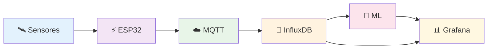

<p align="center">
  
</p>

# Projeto Acadêmico IoT

🌱 **Smart Farm IoT System**  
**🎓 Projeto para Seleção de Mestrado**  
Universidade Pública - Universidade do Oeste do Paraná (Unioeste) - Programa de Pós-Graduação Mestrado em Ciências da Computação/Sistemas - (EDITAL Nº 11/2025 - PPGComp)

`MIT License` `Python` `IoT` `Docker` `ESP32` `Status: Fase 1`

## 📋 Descrição do Projeto
Sistema IoT avançado para monitoramento e automação em agricultura de precisão. O projeto integra sensores ambientais, análise de dados em tempo real e preparação para algoritmos de Machine Learning para otimização de recursos agrícolas.

## 🎯 Objetivos de Pesquisa
- Machine Learning para predição de safras e detecção de anomalias
- Otimização inteligente de recursos hídricos e energéticos
- Integração avançada com sensores multispectrais
- Análise em tempo real com dashboard interativo
- Publicação científica dos resultados obtidos

## 🏗 Arquitetura do Sistema



## 🔐 Segurança da Infraestrutura

### Políticas Implementadas
- **Credenciais**: Armazenadas exclusivamente em variáveis de ambiente (`.env`)
- **Versionamento**: Secrets protegidos via `.gitignore`
- **Tokens**: Gerados dinamicamente para cada ambiente
- **Rede**: Containers isolados em rede bridge dedicada
- **Validação**: Schema validation para todos os payloads MQTT

### Para Ambiente de Produção
```bash
# Gere secrets seguros:
openssl rand -hex 32  # Para tokens
pwgen -s 16 1         # Para senhas
```

## 📁 Estrutura do Projeto

```
smart-farm-iot-system/
├── 📁 src/                    # Código fonte
│   ├── 📁 firmware/          # Código microcontroladores
│   ├── 📁 backend/           # API e processamento
│   ├── 📁 frontend/          # Dashboard web
│   └── 📁 ml-models/         # Modelos machine learning
├── 📁 docker/                # Infraestrutura containerizada
├── 📁 docs/                  # Documentação acadêmica
├── 📁 tests/                 # Testes automatizados
├── 📁 dashboards/            # Configurações Grafana
└── 📁 data/                  # Datasets e dados
```

## 🚀 Quick Start

### 📋 Pré-requisitos
- Docker e Docker Compose instalados
- Git para clonagem do repositório
- 4GB RAM disponível (mínimo recomendado)

### ⚡ Execução Rápida
```bash
# 1. Clone o repositório
git clone https://github.com/GustavoFelipe85/smart-farm-iot-system.git
cd smart-farm-iot-system

# 2. Configure variáveis de ambiente
cp .env.example .env
# Edite o .env com suas credenciais

# 3. Execute a infraestrutura Docker
cd docker
docker compose --env-file ../.env up -d

# 4. Aguarde os serviços inicializarem (≈ 1-2 minutos)
```

## 🔧 Comandos Úteis

```bash
# Verificar status dos containers
docker compose ps

# Ver logs em tempo real
docker compose logs -f

# Parar a infraestrutura
docker compose down
```

## 🌐 Serviços Disponíveis

| Serviço | URL | Descrição |
|---------|-----|-----------|
| **Grafana** | http://localhost:3000 | Dashboard de monitoramento |
| **InfluxDB** | http://localhost:8086 | Banco de dados temporal |
| **Mosquitto** | mqtt://localhost:1883 | Broker MQTT |

Veja `docker/README.md` para detalhes completos.

## 🔬 Metodologia Científica
A metodologia está alinhada à linha de pesquisa Sistemas de Computação, integrando práticas de instrumentação IoT, análise de dados e automação inteligente:

- Revisão bibliográfica do estado da arte em IoT agrícola
- Desenvolvimento iterativo do sistema com testes de campo
- Coleta e análise de dados em condições reais
- Validação estatística dos resultados obtidos
- Comparação com métodos tradicionais

## 📊 Resultados Esperados
- Redução de ≥20% no consumo hídrico
- Aumento de ≥15% na produtividade
- Sistema autônomo com mínima intervenção humana
- Publicação em periódico científico

## 🗓️ Roadmap da Pesquisa

### 🎓 Fase 1: Proposta de Pesquisa (Atual)
- Definição do problema de pesquisa
- Revisão bibliográfica sistemática
- Metodologia científica
- Submissão para a universidade

### 🔬 Fase 2: Desenvolvimento do Sistema
- Prototipagem hardware IoT
- Desenvolvimento do firmware
- API e backend
- Dashboard de monitoramento

### 📊 Fase 3: Análise de Dados
- Coleta de dados em campo
- Análise estatística
- Modelos de machine learning
- Validação dos resultados

### ✍️ Fase 4: Produção Científica
- Redação do artigo
- Submissão para periódico
- Preparação de apresentação

## 📋 Métricas de Progresso

| Fase | Progresso | Previsão |
|------|-----------|----------|
| Proposta | 🔵 90% | Out 2024 |
| Desenvolvimento | 🟡 15% | Dez 2024 |
| Análise | ⚪ 0% | Fev 2025 |
| Publicação | ⚪ 0% | Abr 2025 |

## 👨‍💻 Autor
**Gustavo Felipe Paluch Figueiredo**

- Graduado em Bacharelado em Engenharia da Computação pela Universidade de Santo Amaro (UNISA)
- Email: gustavo.f.p.f@outlook.com.br
- LinkedIn: linkedin.com/in/gustavofpaluch

## 📚 Referências Complementares
- WOLFERT, S. et al. Big Data in Smart Farming – A review. Agricultural Systems, v.153, p.69–80, 2017.
- ZHANG, Y. et al. IoT Applications in Smart Agriculture: A Review. Journal of Agricultural Informatics, v.13, n.1, p.45–60, 2022.
- CONECTARAGRO. Agricultura 4.0: Conectividade no campo. Disponível em: https://conectaragro.com.br.

## 📄 Licença
Este projeto está sob licença MIT. Veja o arquivo LICENSE para detalhes.

## 🤝 Contribuição
Contribuições são bem-vindas! Este é um projeto de pesquisa acadêmica.

- 👨‍🔬 **Pesquisadores**: Como replicar experimentos
- 💻 **Desenvolvedores**: Padrões de código
- 🤝 **Parceiros**: Colaborações acadêmicas

---

**📌 Documento técnico elaborado para fins acadêmicos no contexto do processo seletivo do Programa de Pós-Graduação em Ciência da Computação – UNIOESTE (EDITAL Nº 11/2025 - PPGComp.)**
## 🐳 Execução com Docker

A infraestrutura completa pode ser executada com Docker:


cd docker
docker-compose up -d

Serviços disponíveis:

📊 Grafana: http://localhost:3000

💾 InfluxDB: http://localhost:8086

📡 MQTT Broker: mqtt://localhost:1883

Veja docker/README.md para detalhes completos.

🤝 Contribuição
Contribuições são bem-vindas! Este é um projeto de pesquisa acadêmica.

🔗 Veja nosso Guia de Contribuição para detalhes.

👨‍🔬 Pesquisadores: Como replicar experimentos

💻 Desenvolvedores: Padrões de código

🤝 Parceiros: Colaborações acadêmicas


