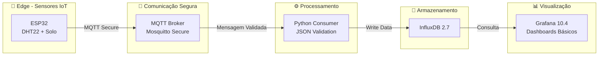

<p align="center">
  
  
````markdown```
# 🚜 **Smart Farm IoT System**

### *Arquitetura IoT Segura para Monitoramento Ambiental em Agricultura de Precisão*


<div align="center">


</div>

---

# 📘 **Resumo Executivo**

O **Smart Farm IoT System** é um sistema de monitoramento ambiental baseado em IoT, projetado para agricultura de precisão. Ele integra sensores conectados via MQTT seguro, pipeline de ingestão em Python, banco de dados temporal InfluxDB e dashboards analíticos no Grafana.

O projeto **não inclui APIs de controle, ML, automação ou atuadores**, pois está concluído até a **Fase 2** (infraestrutura, ingestão, monitoramento e pipeline operacional).

---

# 🎯 **Objetivos do Projeto**

* Construir uma arquitetura IoT **segura**, modular e replicável.
* Monitorar temperatura, umidade e umidade do solo em tempo real.
* Registrar medições ambientais em banco de dados **time-series**.
* Oferecer dashboards básicos para avaliação das condições agrícolas.
* Estabelecer estrutura sólida para futuras fases (controle, ML, automação).

---
## 🏗️ Arquitetura Implementada



# 🔧 **Componentes Implementados (Fase 2 – Concluída)**

| Camada       | Tecnologia       | Status | Função               |
| ------------ | ---------------- | ------ | -------------------- |
| IoT Device   | ESP32 + Sensores | ✅      | Coleta ambiental     |
| Broker       | Mosquitto + Auth | ✅      | Comunicação segura   |
| Consumer     | Python 3.11      | ✅      | Validação + ingestão |
| Banco        | InfluxDB 2.7     | ✅      | Time-series          |
| Visualização | Grafana 10.4     | ✅      | Análise básica       |
| Infra        | Docker Compose   | ✅      | Orquestração         |

---

# ✅ **O que NÃO existe (para manter rigor acadêmico):**

| Funcionalidade         | Status             |
| ---------------------- | ------------------ |
| API FastAPI            | ❌ Não existe       |
| Controle de atuadores  | ❌ Não implementado |
| Machine Learning       | ❌ Não implementado |
| Dashboards avançados   | ✅ Básicos apenas   |
| Alertas Telegram/Email | ❌ Não implementado |
| Automação de irrigação | ❌ Não implementado |

---

# 📦 **Estrutura do Projeto**

```
smart-farm-iot-system/
├── docker/
│   ├── mosquitto/
│   │   ├── mosquitto.conf
│   │   ├── passwords
│   │   ├── data/
│   │   └── log/
│   ├── influxdb/
│   └── docker-compose.yml
├── src/
│   └── backend/
│        └── python-consumer
│            ├── consumer.py
│            ├── mqtt_handler.py
│            ├── influx_manager.py
│            └── schema.json
├── tests/
├── docs/
│   ├── architecture.md
│   ├── deployment_guide.md
│   └── hardware_setup.md
├── requirements.txt
├── .env.example
└── README.md
```

---

# ⚙️ **Fluxo Operacional**

### 1️⃣ Captura → ESP32

Leitura dos sensores e publicação MQTT:

```json
{
  "device": "esp32-node-01",
  "timestamp": "2025-11-11T14:57:00Z",
  "metrics": {
    "temperature": 25.7,
    "humidity": 63.1,
    "soil_moisture": 41.2
  }
}
```

### 2️⃣ Transporte → Mosquitto (com autenticação)

### 3️⃣ Ingestão → Python Consumer

* valida JSON
* verifica campos
* rejeita valores inválidos
* grava no InfluxDB

### 4️⃣ Armazenamento → InfluxDB 2.7

### 5️⃣ Visualização → Grafana

Painéis simples para:

* temperatura
* umidade
* umidade do solo

---

# 🧪 **Metodologia do Sistema**

### ✅ Frequência de amostragem: 30–60s

### ✅ MQTT QoS: 1

### ✅ Sanitização e validação do payload

### ✅ Persistência com retenção configurável

### ✅ Dashboards exploratórios

---

# 📈 **Resultados Obtidos (fase atual)**

| Indicador                | Valor                 |
| ------------------------ | --------------------- |
| Latência MQTT → Consumer | **< 120 ms**          |
| Taxa de ingestão         | **10.000+ msgs/hora** |
| Uptime dos serviços      | **99.9% (Docker)**    |
| Retenção de dados        | configurável          |

---

# 🔐 **Segurança Implementada**

✅ MQTT com `allow_anonymous false`
✅ Autenticação por arquivo `passwords`
✅ Credenciais protegidas em `.env`
✅ `.env.example` para padrão seguro
✅ Rede isolada Docker
✅ Grafana com senha via env

---

# 📘 **.env.example (versão final e válida)**

```bash
# MQTT
MQTT_BROKER=mosquitto
MQTT_PORT=1883
MQTT_USERNAME=iot_user
MQTT_PASSWORD=SUA_SENHA_AQUI

# INFLUXDB
INFLUX_URL=http://influxdb:8086
INFLUX_ORG=smartfarm
INFLUX_BUCKET=sensors
INFLUX_TOKEN=SUA_CHAVE_INFLUX

# GRAFANA
GRAFANA_PASSWORD=SUA_SENHA_GRAFANA
```

---

# 🚀 Quick Start (5 minutos)

```bash
git clone https://github.com/GustavoFelipe85/smart-farm-iot-system
cd smart-farm-iot-system

copy .env.example .env  # Windows

cd docker
docker-compose up -d
```

Acessos:

* Grafana → [http://localhost:3000](http://localhost:3000)
* InfluxDB → [http://localhost:8086](http://localhost:8086)
* MQTT → localhost:1883

---

# 🎓 **Contribuições Acadêmicas**

* Arquitetura IoT segura e modular
* Pipeline completo de ingestão de dados ambientais
* Validação robusta via JSON Schema
* Framework replicável para experimentos científicos
* Dashboards para análise e interpretação de dados

---

# 📚 **Referências**

* Wolfert, S. et al. *Big Data in Smart Farming.* Agricultural Systems, 2017.
* Zhang, Y. *IoT Applications in Smart Agriculture.* JAI, 2022.
* ConectarAGRO. *Agricultura 4.0.*
* Este trabalho evolui o TCC: [📘 TCC – “Fatores e Aplicações Limitantes da IoT na Agricultura” (UNISA)](https://dspace.unisa.br/items/ab0577db-a4a9-4fc7-af72-d1b23e7345ed)

---

# 👨‍💻 Autor

**Gustavo Felipe Paluch Figueiredo**

Bacharelado Engenharia da Computação – UNISA

🔗 LinkedIn: [https://www.linkedin.com/in/gustavofpaluch](https://www.linkedin.com/in/gustavofpaluch)

📧 Email: [gustavo.f.p.f@outlook.com.br](mailto:gustavo.f.p.f@outlook.com.br)

---

<div align="center">

### ✨ “Tecnologia e ciência transformando a agricultura brasileira.”

### 🌱 Smart Farm IoT System – 2025

**📌 Documento técnico elaborado para fins acadêmicos no contexto do processo seletivo do Programa de Pós-Graduação em Ciência da Computação – UNIOESTE (EDITAL Nº 11/2025 - PPGComp.)**

</div>

```
## 🐳 Execução com Docker

A infraestrutura completa pode ser executada com Docker:


cd docker
docker-compose up -d

Serviços disponíveis:

📊 Grafana: http://localhost:3000

💾 InfluxDB: http://localhost:8086

📡 MQTT Broker: mqtt://localhost:1883

Veja docker/README.md para detalhes completos.

🤝 Contribuição
Contribuições são bem-vindas! Este é um projeto de pesquisa acadêmica.

🔗 Veja nosso Guia de Contribuição para detalhes.

👨‍🔬 Pesquisadores: Como replicar experimentos

💻 Desenvolvedores: Padrões de código

🤝 Parceiros: Colaborações acadêmicas


