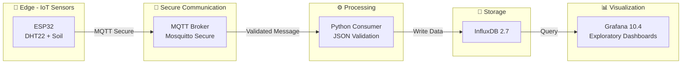

# 🚜 Smart Farm IoT System

### Secure IoT Architecture for Environmental Monitoring in Precision Agriculture

[](README.md)


<p align="center">
  
  
  
  
  
  
  <a href="https://github.com/GustavoFelipe85/smart-farm-iot-system/actions/workflows/ci.yml">
    
  </a>
</p>

---

## Executive Summary

The Smart Farm IoT System is a modular, secure, and reproducible IoT platform for environmental monitoring applied to precision agriculture.  
It integrates low-cost sensor nodes, authenticated MQTT communication, Python-based data processing, a time-series database (InfluxDB), and analytical dashboards in Grafana. The entire stack is contai[...]

This repository documents Phase 2 (completed) and the ongoing work for Phase 3 (real hardware and AI-assisted PCB design).

---

> Note: This project was prepared as part of an application to the Graduate Program in Computer Science (PPGComp) – UNIOESTE and follows reproducibility and methodological guidelines aligned with th[...]

---

## CI Pipeline Status

The CI pipeline is active and performs automated validations covering code quality, data contracts, documentation, and infrastructure configuration.

These checks are aligned with the experimental scope of **Phase 3 (Real Hardware / CELUS)**, focusing on architectural consistency, pipeline integrity, and technical traceability.

The consolidation of hardware-dependent tests and field measurements is planned as part of the natural progression of the project in **Phase 4 and beyond**.

---

## Project Objectives

- Design a secure, modular, and replicable IoT architecture for agricultural monitoring.  
- Measure air temperature, relative humidity, and soil moisture.  
- Persist telemetry in a time-series database and provide analytical dashboards.  
- Provide a foundation for automation, control, and machine learning for irrigation optimization.  

---

## Documentation

All technical and planning documentation is available in the docs folder:

➡️ [`/docs`](./docs)  
➡️ International alignment and sustainability: [`docs/alinhamento_internacional_en.md`](./docs/alinhamento_internacional_en.md)

---

## Documents by Phase

| Phase | Document | Contents | Status |
| ----- | -------- | -------- | ------ |
| Phase 1 | [`docs/fase1.md`](./docs/fase1.md) | IoT infrastructure, secure MQTT | ✅ Completed |
| Phase 2 | [`docs/fase2.md`](./docs/fase2.md) | Data ingestion, persistence, dashboards | ✅ Completed |
| Phase 3 | [`docs/fase3.md`](./docs/fase3.md) | Real hardware, CELUS, lab testing | 🟡 In Progress |

---

## System Architecture (Implemented — Phase 2)



---

## Implemented Components (Phase 2)

| Layer          | Technology       | Status | Purpose                  |
| -------------- | ---------------- | ------ | ------------------------ |
| Edge device    | ESP32 + sensors  | ✅      | Environmental sensing    |
| Broker         | Mosquitto + auth | ✅      | Secure communication     |
| Consumer       | Python 3.11      | ✅      | Validation and ingestion |
| Database       | InfluxDB 2.7     | ✅      | Time-series storage      |
| Visualization  | Grafana 10.4     | ✅      | Dashboards               |
| Orchestration  | Docker Compose   | ✅      | Reproducible deployment  |

---

## Not Implemented / Roadmap (Academic scope)

- FastAPI-based REST API (not implemented)  
- Actuator control and irrigation automation (not implemented)  
- Machine learning models for prediction/control (planned)  
- Advanced dashboards and alerting (basic dashboards available)

---

## Operational Flow (example payload)

Acquisition (ESP32):

```json
{
  "device": "esp32-node-01",
  "timestamp": "2025-11-11T14:57:00Z",
  "metrics": {
    "temperature": 25.7,
    "humidity": 63.1,
    "soil_moisture": 41.2
  }
}
```

1. Device publishes authenticated MQTT message.  
2. Python consumer validates schema and ingests data.  
3. Data persisted in InfluxDB.  
4. Grafana dashboards query InfluxDB for visualization.

---

## Experimental Methodology (summary)

- Sampling frequency: 30 s  
- MQTT QoS: 1  
- Payload validation (schema sanitization)  
- Retention policies configured in InfluxDB  
- Exploratory analysis via Jupyter notebooks

---

## Key Results (Phase 2)

| Metric                  | Observed Value     |
| ----------------------- | ------------------ |
| MQTT → Consumer latency | < 120 ms           |
| Ingestion throughput    | 10,000+ msgs/h     |
| Docker uptime           | ~99.9%             |
| Retention               | Configurable        |

(Complete analysis and experimental notebooks are available in the repository.)

---

## Security Measures

- Mosquitto configured with `allow_anonymous false`  
- File-based authentication for MQTT users  
- Secrets handled via environment variables (`.env`), `.env.example` included  
- Docker services run in an isolated network  
- Grafana credentials injected via environment variables

---

## Quick Start (local, ~5 minutes)

```bash
git clone https://github.com/GustavoFelipe85/smart-farm-iot-system
cd smart-farm-iot-system

cp .env.example .env   # Linux / macOS
# copy .env.example .env  # Windows

cd docker
docker-compose up -d
```

Access:
- Grafana: http://localhost:3000  
- InfluxDB: http://localhost:8086  
- MQTT broker: mqtt://localhost:1883

---

## Academic Contributions

- Secure, modular IoT architecture for precision agriculture  
- Reproducible ingestion pipeline and visualization stack  
- Notebooks and documentation to support scientific validation  
- Foundation for automation and ML research in agricultural settings

---

## References

- Wolfert, S. et al., "Big Data in Smart Farming", Agricultural Systems, 2017.  
- Zhang, Y., "IoT Applications in Smart Agriculture", JAI, 2022.  
- ConectarAGRO — Agriculture 4.0 resources.  
- Related undergraduate thesis: "Limiting Factors and Applications of IoT in Agriculture" (UNISA) — https://dspace.unisa.br/items/ab0577db-a4a9-4fc7-af72-d1b23e7345ed

---

## Author

**Gustavo Felipe Paluch Figueiredo**  
B.Sc. Computer Engineering — Universidade Santo Amaro (UNISA)

LinkedIn: https://www.linkedin.com/in/gustavofpaluch  
Email: gustavo.f.p.f@outlook.com.br

---

*This repository documents Phase 2 and provides the foundation for Phase 3 (real hardware and automation). Contributions and feedback are welcome.*
