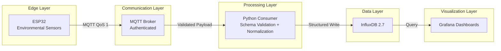

# 🚜 Smart Farm IoT System

[](https://github.com/GustavoFelipe85/smart-farm-iot-system/blob/main/README.md) 

### A Versioned Distributed IoT Architecture for Reliable Environmental Data Ingestion in Precision Agriculture

## 1. Overview

Smart Farm IoT System is an applied research software artifact that investigates structural reliability, data contract versioning, and reproducible infrastructure in distributed IoT environments for precision agriculture.

The system implements a fully containerized, end-to-end pipeline integrating:

* Embedded sensing (ESP32-based nodes)
* Authenticated MQTT communication
* Canonical schema validation (JSON Schema, Draft-07)
* Normalized ingestion services (Python 3.11)
* Time-series persistence (InfluxDB 2.7)
* Analytical visualization (Grafana 10.4)

The project is designed as a reproducible research platform to support experimentation on data integrity, ingestion robustness, and distributed telemetry reliability.

---

## 2. Research Problem

In distributed IoT agricultural environments, telemetry pipelines frequently suffer from:

* Schema drift
* Inconsistent payload structures
* Weak validation mechanisms
* Limited reproducibility
* Infrastructure coupling

These issues compromise data integrity, experimental reproducibility, and system-level reliability.

---

## 3. Research Hypothesis

A versioned data contract combined with strict schema validation, containerized infrastructure, and structured ingestion normalization increases telemetry robustness, reduces schema-related failures, and improves reproducibility in distributed IoT systems.

---

## 4. System Architecture



---

## 5. Canonical Data Contract

The official telemetry contract is defined in:

```
src/backend/schemas/sensor_payload.json
```

Example canonical payload:

```json
{
  "schema_version": "1.0.0",
  "device": "esp32-node-01",
  "timestamp": "2025-11-11T14:57:00Z",
  "metrics": {
    "temperature": 25.7,
    "humidity": 63.1,
    "soil_moisture": 41.2,
    "soil_raw": null
  }
}
```

Characteristics:

* Semantic versioning (`schema_version`)
* Strict `additionalProperties: false`
* Required structural fields
* Backward normalization support for legacy payloads
* Explicit null-handling (null ≠ 0)

This contract functions as the single source of truth for ingestion validation.

---

## 6. Reproducibility & Infrastructure

The entire stack is reproducible via Docker Compose.

```bash
git clone https://github.com/GustavoFelipe85/smart-farm-iot-system
cd smart-farm-iot-system
cp .env.example .env
cd docker
docker-compose up -d
```

The system includes:

* Environment-isolated containers
* Secret management via environment variables
* CI pipeline (GitHub Actions)
* Automated schema validation tests
* Deterministic dependency control

This design aligns with reproducible research software principles.

---

## 7. Experimental Configuration

* Sampling frequency: 30 seconds
* MQTT QoS: 1
* Schema validation enforced before persistence
* InfluxDB retention policies configurable
* Exploratory notebooks for time-series inspection

---

## 8. Observed Results (Phase 2)

| Metric                   | Observed Value |
| ------------------------ | -------------- |
| MQTT → Consumer latency  | < 120 ms       |
| Sustained ingestion rate | 10,000+ msgs/h |
| Container uptime (local) | ~99.9%         |

These results demonstrate pipeline stability under controlled experimental conditions.

---

## 9. Implemented Scope

✔ Distributed ingestion pipeline
✔ Versioned schema validation
✔ Canonical normalization logic
✔ Containerized deployment
✔ Time-series persistence
✔ CI validation

---

## 10. Not Implemented (Research Roadmap)

* Closed-loop irrigation automation
* ML-based soil moisture prediction
* REST orchestration layer
* Fault-injection resilience experiments
* Field deployment stress testing

These extensions define the next experimental phases.

---

## 11. Scientific Contribution

This repository contributes to:

* Reliability engineering in distributed IoT systems
* Versioned telemetry contract enforcement
* Research software reproducibility in applied computing
* Data integrity in agricultural IoT environments

The system operates as a research-grade artifact suitable for experimental extension and academic evaluation.

---

## 12. Related Work

* Wolfert, S. et al. *Big Data in Smart Farming*, Agricultural Systems, 2017.
* Zhang, Y. *IoT Applications in Smart Agriculture*, JAI, 2022.

---

## Author

Gustavo Felipe Paluch Figueiredo
B.Sc. Computer Engineering

Independent Applied Research in IoT, Distributed Systems, and Data Infrastructure

---


