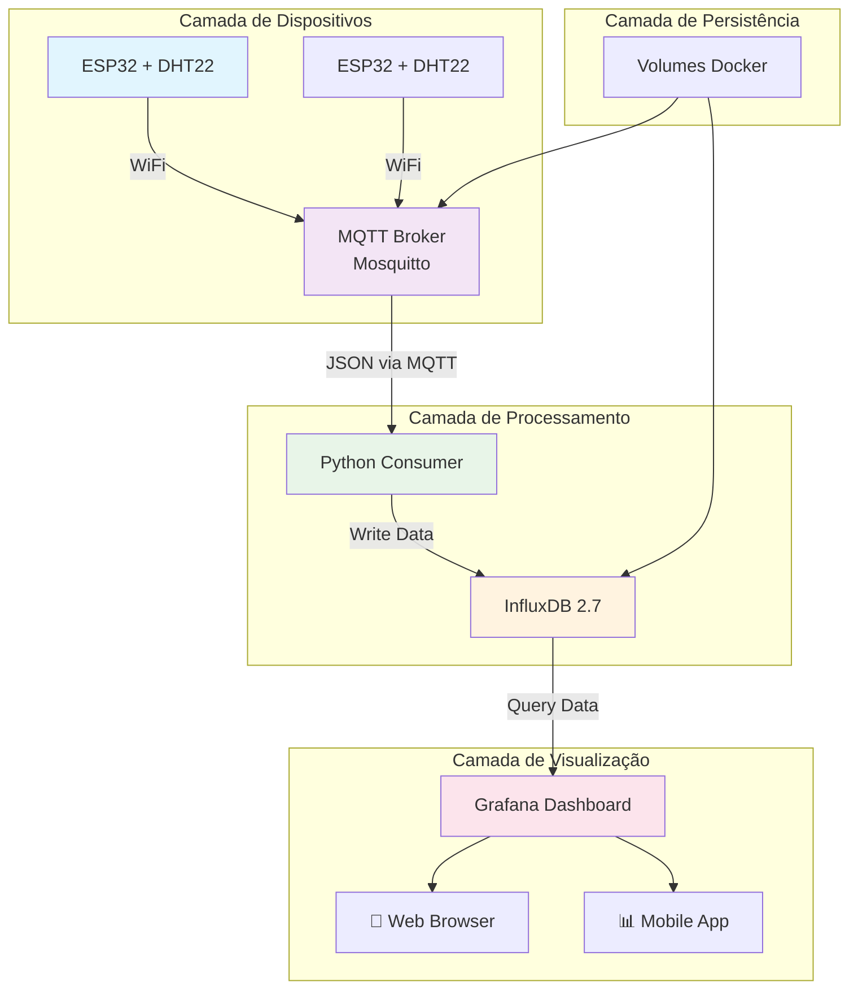

# Arquitetura do Sistema Smart Farm IoT

## Visão Geral
Sistema de monitoramento de temperatura e umidade para agricultura de precisão.

## Diagrama
```
ESP32 (DHT22) → MQTT (Mosquitto) → Python Consumer → InfluxDB → Grafana
```

## Componentes
- **ESP32**: Coleta dados do sensor DHT22
- **Mosquitto**: Broker MQTT na porta 1883  
- **Python Consumer**: Processa e armazena no InfluxDB
- **InfluxDB**: Banco de dados time-series
- **Grafana**: Dashboard de visualização

## Fluxo de Dados
1. ESP32 publica JSON no tópico `smartfarm/sensors`
2. Consumer Python grava no InfluxDB
3. Grafana visualiza dados em tempo real
```

## 🚀 **VERSÃO MELHORADA** (sugestão):

**Arquivo: `docs/architecture.md`**
```markdown
# Arquitetura do Sistema Smart Farm IoT

## 🎯 Visão Geral

Sistema de monitoramento em tempo real para agricultura de precisão, coletando dados de temperatura e umidade através de sensores ESP32, processando via MQTT e armazenando em banco de dados time-series para visualização em dashboards.

## 📊 Diagrama de Arquitetura



## 🏗️ Componentes do Sistema

### 1. 🎛️ Camada de Dispositivos (Edge)
- **Microcontrolador**: ESP32 com WiFi
- **Sensores**: DHT22 (Temperatura e Umidade)
- **Protocolo**: MQTT over WiFi
- **Frequência**: Leitura a cada 5 segundos

### 2. 🔄 Camada de Mensageria
- **Broker**: Mosquitto MQTT
- **Porta**: 1883 (TCP)
- **Tópico**: `smartfarm/sensors`
- **Formato**: JSON
- **QoS**: 1 (Pelo menos uma vez)

### 3. ⚙️ Camada de Processamento
- **Linguagem**: Python 3.8+
- **Bibliotecas**: paho-mqtt, influxdb-client
- **Função**: Consumir MQTT → Converter → InfluxDB
- **Resiliência**: Reconexão automática

### 4. 💾 Camada de Armazenamento
- **Banco**: InfluxDB 2.7
- **Bucket**: `sensors`
- **Org**: `smartfarm`
- **Medição**: `environment`
- **Tags**: `device`
- **Fields**: `temperature`, `humidity`

### 5. 📈 Camada de Visualização
- **Dashboard**: Grafana 10.2+
- **Fonte**: InfluxDB (Flux queries)
- **Atualização**: 5 segundos
- **Métricas**: Tempo real + histórico

## 🔄 Fluxo de Dados Detalhado

### 1. Coleta no Dispositivo
```cpp
// ESP32 - Leitura do sensor
float temp = dht.readTemperature();  // 24.3°C
float umid = dht.readHumidity();     // 60.1%

// Payload MQTT
String payload = "{\"device\":\"esp32-node-1\",\"temp\":24.3,\"umid\":60.1}";
```

### 2. Transmissão MQTT
```
Tópico: smartfarm/sensors
Mensagem: {"device":"esp32-node-1","temp":24.3,"umid":60.1}
QoS: 1 | Retained: true
```

### 3. Processamento no Consumer
```python
# Recebe MQTT → Converte → InfluxDB
point = Point("environment") \
    .tag("device", "esp32-node-1") \
    .field("temperature", 24.3) \
    .field("humidity", 60.1)
```

### 4. Armazenamento InfluxDB
```
Measurement: environment
Tags: device=esp32-node-1
Fields: temperature=24.3, humidity=60.1
Timestamp: 2024-01-15T10:30:00Z
```

### 5. Visualização Grafana
```flux
from(bucket: "sensors")
  |> range(start: -1h)
  |> filter(fn: (r) => r._measurement == "environment")
  |> filter(fn: (r) => r._field == "temperature")
```

## 🔧 Especificações Técnicas

### Mensagens MQTT
```json
{
  "device": "string_identificador",
  "temp": "float[-20.0 à 80.0]",
  "umid": "float[0.0 à 100.0]"
}
```

### Esquema InfluxDB
- **Measurement**: `environment`
- **Tags**: 
  - `device` (string): Identificador do sensor
- **Fields**:
  - `temperature` (float): Graus Celsius
  - `humidity` (float): Percentual
- **Timestamp**: Auto-gerado

### Portas e Endpoints
| Serviço | Porta | Protocolo | Uso |
|---------|-------|-----------|-----|
| Mosquitto | 1883 | TCP/MQTT | Dispositivos → Broker |
| InfluxDB | 8086 | HTTP | Consumer → Database |
| Grafana | 3000 | HTTP | Usuário → Dashboard |

## 🛡️ Considerações de Segurança

### Desenvolvimento
- MQTT: Autenticação anônima
- InfluxDB: Token estático
- Rede: Localhost/isolada

### Produção (Recomendado)
- MQTT: SSL/TLS + Autenticação
- InfluxDB: Token rotativo
- Rede: VPN/VPC
- Firewall: Portas restritas

## 📈 Escalabilidade

### Horizontal (Mais Dispositivos)
- Adicionar mais ESP32
- Balanceamento de tópicos MQTT
- Sharding no InfluxDB

### Vertical (Mais Recursos)
- Cluster Mosquitto
- InfluxDB replicado
- Load Balancer Grafana

## 🔄 Resiliência

### Tolerância a Falhas
- Reconexão automática MQTT
- Retry mechanism no consumer
- Persistência em disco
- Health checks Docker

### Monitoramento
- Logs estruturados
- Métricas de performance
- Alertas de saúde

---

## 🎯 Próximas Evoluções

### Fase 2 (Em Planejamento)
- [ ] Dashboard web customizado
- [ ] Sistema de alertas
- [ ] Controle de atuadores
- [ ] Autenticação JWT

### Fase 3 (Futuro)
- [ ] Machine Learning (anomalias)
- [ ] Clusterização
- [ ] API REST
- [ ] Mobile App

---

**Manutenção**: GustavoFelipe85  
**Última Atualização**: {{DATA_ATUAL}}  
**Versão da Arquitetura**: 1.0
```

## 🎯 **MELHORIAS PROPOSTAS:**

1. **✅ Diagrama visual** (Mermaid.js)
2. **✅ Estrutura em camadas** clara
3. **✅ Fluxo de dados detalhado**
4. **✅ Especificações técnicas completas**
5. **✅ Considerações de segurança**
6. **✅ Estratégia de escalabilidade**
7. **✅ Plano de evolução futura**

## 🔄 **PARA ATUALIZAR SEU REPOSITÓRIO:**

```bash
# Substituir o arquivo atual
# Salve o conteúdo acima como: docs/architecture.md

git add docs/architecture.md
git commit -m "docs: atualiza arquitetura com diagramas e especificações completas"
git push origin main
```

